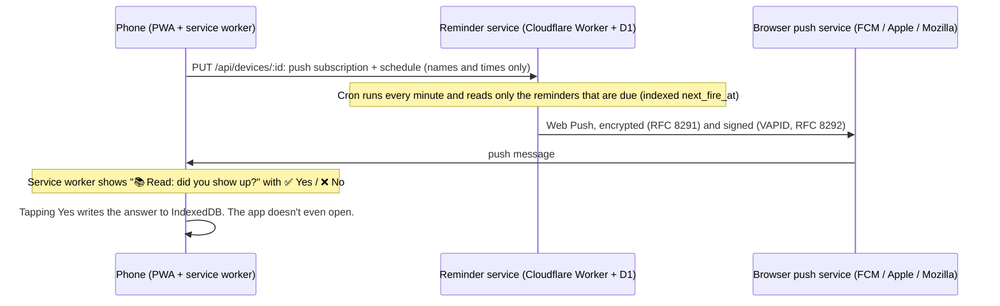

<div align="center">


# Tell Me

**A habit tracker built around one question: _did you show up?_**

Write your schedule in plain English. When it's time, your phone asks **Yes or No**.<br/>
Every week you get a report that shows what's working and what isn't.<br/>
Runs as a **web app** on any device and as a **native iPhone app**.

[**Open the app**](https://mithuncreates99.github.io/tell-me/) · [**Try it with demo data**](https://mithuncreates99.github.io/tell-me/#/demo) · [iPhone app](docs/IOS.md) · [How it works](docs/ARCHITECTURE.md) · [Deploy your own](docs/DEPLOY.md) · [Product case study](docs/CASE_STUDY.md)

[](https://github.com/mithuncreates99/tell-me/actions/workflows/ci.yml) [](LICENSE)


</div>

## Why

Most habit apps ask you to log details, and most people stop logging after a week or two. Tell Me cuts it down to one tap at the right moment: a notification asks _"Gym: did you show up?"_ with **✅ Yes** and **❌ No** buttons. Those answers are enough to find real patterns, like a weak day of the week, an evening habit that keeps slipping, or the excuse behind most of your misses.

## Features

- **Plain-English quick add.** `Gym Mon Wed Fri 6pm`, `French class Tue/Thu 19h30`, `Read daily 22:00`, `Run 3x a week`. You can also paste or import a whole schedule (text, CSV or a backup file).
- **Native iPhone app.** The same app in a native shell (Capacitor). Reminders are scheduled on the phone itself with **✅ Yes / ❌ No** buttons right on the notification, with no server at all. Share it through TestFlight or the App Store ([guide](docs/IOS.md)).
- **Yes/No push reminders on the web.** On Android and desktop Chrome/Edge you answer straight from the notification, without opening the app. On iPhone (Home Screen web app, iOS 16.4+) and Safari you tap the notification to answer.
- **"What got in the way?"** One tap after a No (too tired, too busy, forgot…) feeds the insights.
- **Weekly report.** Completion rate, a fair comparison with _this time last week_, a per-habit week grid, streaks, an 8-week trend, completion by weekday, reasons for missing, and a 16-week consistency heatmap.
- **Insights in plain language.** _"Fridays are your weak spot: 42% vs 75% overall."_ _"'Too tired' is behind 11 of your 18 misses."_ _"You show up more in the morning."_ Every rule needs a minimum amount of data, so it doesn't report patterns built on two data points.
- **Private by default.** Habits and answers live only on your device (IndexedDB). The reminder server only knows each habit's name, emoji and time, never your answers.
- **Installable PWA.** Works offline, dark mode, calendar view, JSON backup and restore, and a calendar file (.ics) when push isn't available.
- **Accessible.** Every chart has a table view, the hover tooltips also work on keyboard focus, all controls are labelled, and reduced-motion settings are respected.

| Weekly report | Calendar | Quick add | Dark mode |
| :---: | :---: | :---: | :---: |
|  |  |  |  |

## How it works



In the **iPhone app** there is no server in the loop: the phone schedules its own "Did you show up?" notifications for the next 10 days and the Yes/No buttons answer them ([docs/IOS.md](docs/IOS.md)).

More detail, including design decisions, trade-offs and scaling notes, is in [docs/ARCHITECTURE.md](docs/ARCHITECTURE.md).

## Tech stack

| | |
| --- | --- |
| **Web app** (`web/`) | React 19, TypeScript, Vite 8, Tailwind CSS 4, Zustand, IndexedDB (`idb`), Workbox service worker via `vite-plugin-pwa`, hand-built SVG charts |
| **iPhone app** (`web/ios`) | Capacitor 8 (Swift Package Manager), local notifications with actionable Yes/No categories, native storage backup, iOS share sheet |
| **Reminder service** (`api/`) | Cloudflare Workers, Hono, D1 (SQLite), Zod, cron triggers, Web Push written on the Web Crypto API |
| **Quality** | Vitest (88 unit tests), an integration test that runs the real worker locally against a mock push service (12 checks), Playwright end-to-end tests (30 checks, including the iPhone code paths behind a fake native shell), GitHub Actions CI |
| **Hosting** | GitHub Pages (web) and Cloudflare Workers Free (API). Both cost €0. |

### Engineering highlights

- **Local-first, server knows almost nothing.** The page and the service worker share one IndexedDB database, so a Yes tapped on a notification is saved even when the app is closed. The server stores push subscriptions and reminder times, not results.
- **Declarative sync.** The app always sends the full desired schedule. The server replaces it in one transaction, and an unchanged schedule is skipped using a hash.
- **Time-zone-correct scheduler.** Each reminder stores its next fire time in UTC, computed in the user's own zone with `Intl`, so DST and half-hour zones are handled. Each cron tick runs one indexed query instead of scanning every user. Habits already answered are skipped (`skipDates`).
- **Fits the free tier.** Workers Free allows about 10 ms of CPU per cron run. Signed VAPID tokens are cached, and pushes are batched at 8 per tick. That is about 11,500 reminders a day, well within the free limits.
- **Web Push from the RFCs.** The `aes128gcm` encryption and VAPID signing are written on the Web Crypto API. The tests check them against Mozilla's reference decryptor.
- **Security.** Device tokens are stored as SHA-256 hashes and compared in constant time, push endpoints are allowlisted (so the worker can't be used for SSRF), all input is validated with Zod, and CORS is configurable.

## Run it locally

Requires Node 22+.

```bash
git clone https://github.com/mithuncreates99/tell-me.git
cd tell-me
npm run setup        # installs root, api/ and web/ dependencies
npm run dev:web      # http://localhost:5173 (everything except push works without the server)
```

To run the reminder service locally as well:

```bash
cd api
cp .dev.vars.example .dev.vars
npm run vapid                 # paste the two keys it prints into .dev.vars
npm run db:migrate:local
npm run dev                   # http://localhost:8787 (trigger the cron with /__scheduled)
# in another terminal:
cd web && VITE_API_URL=http://localhost:8787 npm run dev
```

## Tests

```bash
npm run typecheck          # api + web + service worker
npm test                   # unit tests (Vitest)
npm run test:integration   # real worker + local D1 + cron + mock push service
npm run test:e2e           # Playwright: UI flows, the full push flow, and the iPhone app paths
```

The push end-to-end test runs the real app and service worker against the real worker. Only the browser's push subscription is faked, because headless Chromium has no push service. The test uses a key pair it controls, so the mock push service can decrypt exactly what a phone would receive.

## Deploy your own

- **Web app + reminder service:** free, about 20 minutes. The web app goes on GitHub Pages and the reminder service on Cloudflare Workers. Step-by-step: **[docs/DEPLOY.md](docs/DEPLOY.md)**.
- **iPhone app:** open `web/ios` in Xcode, run it on your phone, and share it with TestFlight. Step-by-step: **[docs/IOS.md](docs/IOS.md)**.

## Project structure

```
tell-me/
├── web/                  React app (web + iPhone)
│   ├── ios/              Xcode project for the native iPhone app (Capacitor)
│   ├── src/lib/          domain logic: schedule, stats, insights, parser, push, local reminders, storage
│   ├── src/screens/      Today, Calendar, Report, Habits, Settings, Check-in
│   ├── src/charts/       SVG charts with table views
│   ├── src/sw.ts         service worker (push → notification → answer)
│   └── test/             unit tests
├── api/                  Cloudflare Worker
│   ├── src/              routes, scheduler, time zones, Web Push, D1 access
│   ├── migrations/       D1 schema
│   └── test/             unit tests (+ scripts/integration-test.mjs)
├── e2e/                  Playwright end-to-end tests and screenshot generator
└── docs/                 deploy guide, iPhone guide, architecture, product case study
```

## Roadmap

- Optional account with end-to-end-encrypted sync across devices
- Flexible goals ("3 times a week" without fixed days)
- French interface
- An opt-in AI-written weekly summary on top of the rule-based insights
- An iPhone Home Screen widget showing today's check-ins

## License

MIT © 2026 Mithun. See [LICENSE](LICENSE).
