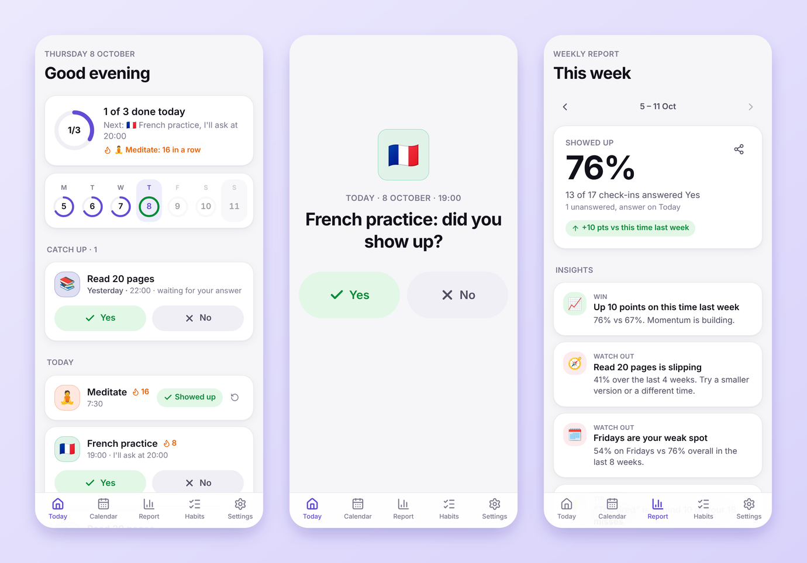
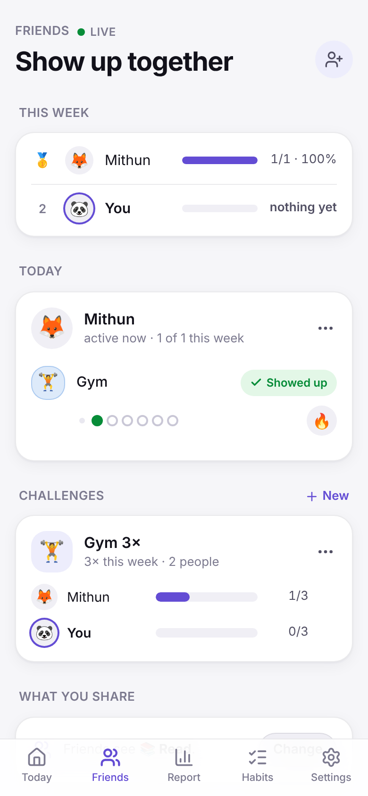
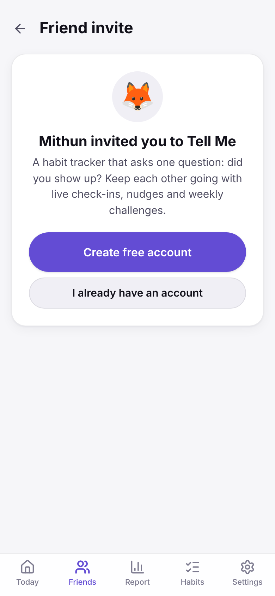
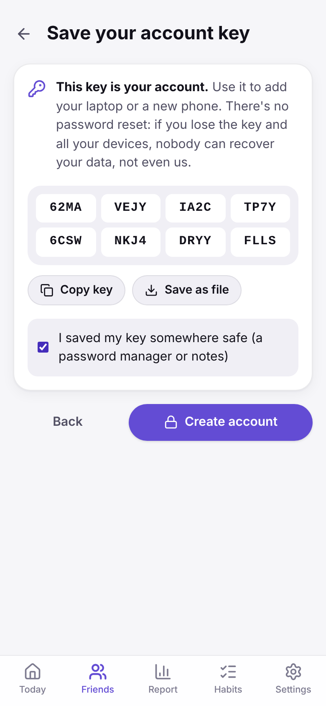
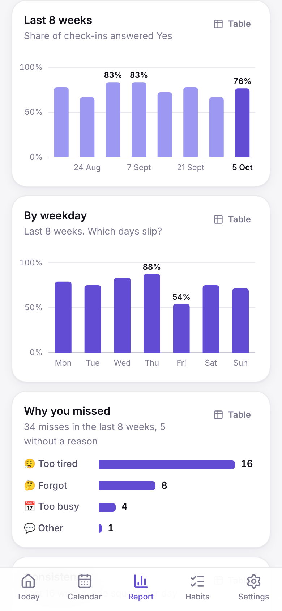
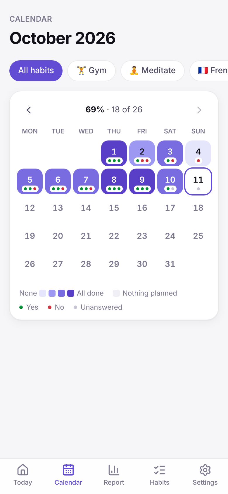
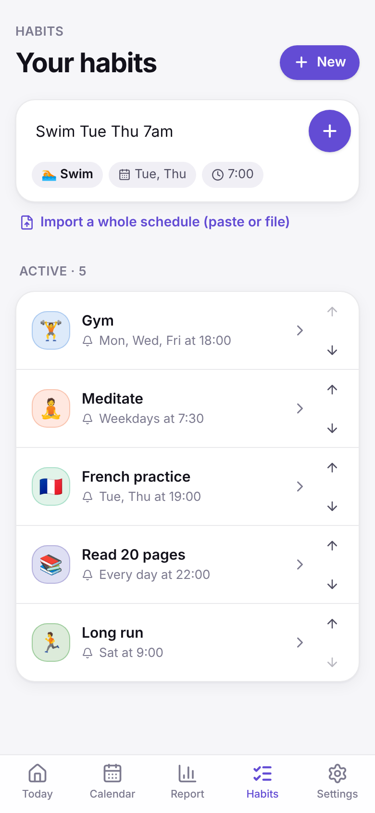
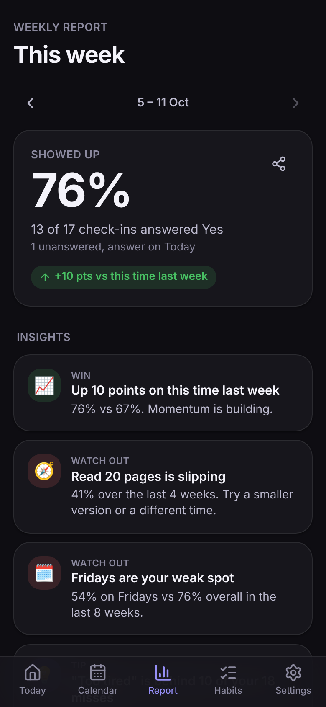
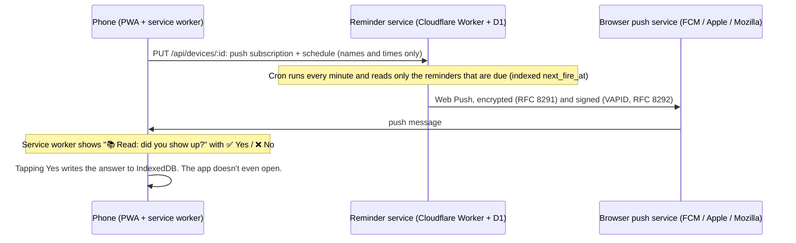
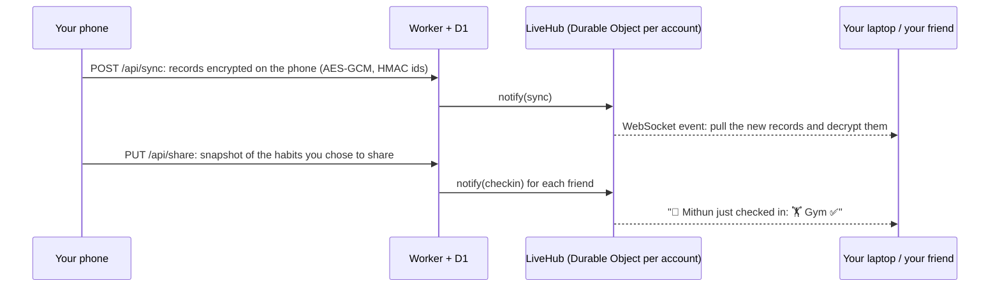

<div align="center">


# Tell Me

**A habit tracker built around one question: _did you show up?_**

Write your schedule in plain English. When it's time, your phone asks **Yes or No**.<br/>
Every week you get a report that shows what's working and what isn't.<br/>
Add friends to see each other's check-ins **live**, nudge, cheer and run weekly challenges.<br/>
Runs as a **web app** on any device and as a **native iPhone app**, synced with **end-to-end encryption**.

[**Open the app**](https://mithuncreates99.github.io/tell-me/) · [**Try it with demo data**](https://mithuncreates99.github.io/tell-me/#/demo) · [iPhone app](docs/IOS.md) · [How it works](docs/ARCHITECTURE.md) · [Deploy your own](docs/DEPLOY.md) · [Product case study](docs/CASE_STUDY.md)

[](https://github.com/mithuncreates99/tell-me/actions/workflows/ci.yml) [](LICENSE)



</div>

## Why

Most habit apps ask you to log details, and most people stop logging after a week or two. Tell Me cuts it down to one tap at the right moment: a notification asks _"Gym: did you show up?"_ with **✅ Yes** and **❌ No** buttons. Those answers are enough to find real patterns, like a weak day of the week, an evening habit that keeps slipping, or the excuse behind most of your misses.

## Features

- **Plain-English quick add.** `Gym Mon Wed Fri 6pm`, `French class Tue/Thu 19h30`, `Read daily 22:00`, `Run 3x a week`. You can also paste or import a whole schedule (text, CSV or a backup file).
- **Native iPhone app.** The same app in a native shell (Capacitor). Reminders are scheduled on the phone itself with **✅ Yes / ❌ No** buttons right on the notification, with no server at all. Share it through TestFlight or the App Store ([guide](docs/IOS.md)).
- **Yes/No push reminders on the web.** On Android and desktop Chrome/Edge you answer straight from the notification, without opening the app. On iPhone (Home Screen web app, iOS 16.4+) and Safari you tap the notification to answer.
- **"What got in the way?"** One tap after a No (too tired, too busy, forgot…) feeds the insights.
- **Weekly report.** Completion rate, a fair comparison with _this time last week_, a per-habit week grid, streaks, an 8-week trend, completion by weekday, reasons for missing, and a 16-week consistency heatmap.
- **Insights in plain language.** _"Fridays are your weak spot: 42% vs 75% overall."_ _"'Too tired' is behind 11 of your 18 misses."_ _"You show up more in the morning."_ Every rule needs a minimum amount of data, so it doesn't report patterns built on two data points.
- **Friends, live.** Invite friends with a link. See their shared habits update the moment they say Yes, react with 🔥 👏 💪, send a nudge when a check-in is waiting, and climb the weekly leaderboard.
- **Weekly challenges.** "Gym 3× this week": everyone picks one of their own habits, and progress updates live and resets every week.
- **Sync across devices, end-to-end encrypted.** An optional account with no email and no password: a secret key your devices keep. Every habit and answer is encrypted on the device (AES-256-GCM) before upload, so the server can't read them.
- **Private by default.** Without an account, everything stays on your device (IndexedDB). With one, friends only ever see the habits you choose to share, and the reminder server never learns your answers. [Privacy details](docs/PRIVACY.md)
- **Installable PWA.** Works offline, dark mode, calendar view, JSON backup and restore, and a calendar file (.ics) when push isn't available.
- **Accessible.** Every chart has a table view, the hover tooltips also work on keyboard focus, all controls are labelled, and reduced-motion settings are respected.

| Friends, live | Invite link | No-password account | Weekly report |
| :---: | :---: | :---: | :---: |
|  |  |  |  |

| Calendar | Quick add | Dark mode |
| :---: | :---: | :---: |
|  |  |  |

## How it works



In the **iPhone app** there is no server in the loop for reminders: the phone schedules its own "Did you show up?" notifications for the next 10 days and the Yes/No buttons answer them ([docs/IOS.md](docs/IOS.md)).

**Accounts, sync and friends** add a second path:



More detail, including design decisions, trade-offs and scaling notes, is in [docs/ARCHITECTURE.md](docs/ARCHITECTURE.md).

## Tech stack

| | |
| --- | --- |
| **Web app** (`web/`) | React 19, TypeScript, Vite 8, Tailwind CSS 4, Zustand, IndexedDB (`idb`), Workbox service worker via `vite-plugin-pwa`, hand-built SVG charts |
| **iPhone app** (`web/ios`) | Capacitor 8 (Swift Package Manager), local notifications with actionable Yes/No categories, native storage backup, iOS share sheet |
| **Server** (`api/`) | Cloudflare Workers, Hono, D1 (SQLite), Durable Objects (WebSocket hibernation), Zod, cron triggers, Web Push written on the Web Crypto API |
| **Encryption** | Web Crypto API on the device: HKDF-SHA256 key derivation, AES-256-GCM records, HMAC-SHA256 opaque ids |
| **Quality** | Vitest (150 unit tests), an integration test that runs the real worker locally with D1, Durable Objects and a mock push service (23 checks), a privacy suite against the same real worker (54 checks), Playwright end-to-end tests (48 checks, including two users and a second device in real browsers, a three-browser privacy run, and the iPhone code paths behind a fake native shell), GitHub Actions CI |
| **Hosting** | GitHub Pages (web) and Cloudflare Workers Free (API). Both cost €0. |

### Engineering highlights

- **Local-first, server knows almost nothing.** The page and the service worker share one IndexedDB database, so a Yes tapped on a notification is saved even when the app is closed. The server stores push subscriptions, reminder times and ciphertext.
- **End-to-end encrypted sync.** One random account key per user; HKDF derives an auth secret (the server stores its hash), an AES-GCM key and an HMAC key that never leave the device. Records sync with last-writer-wins, and a per-account sequence number is reserved in the same D1 transaction as the write, so no device can ever skip a change.
- **Live updates for €0.** Each account has a Durable Object holding its WebSockets with the hibernation API (idle connections are free); the app authenticates with a WebSocket subprotocol because browsers can't send headers there.
- **Friends without giving up privacy.** Only habits marked as shared are published, as a small snapshot. The server moves stale snapshots forward in the owner's time zone, so leaderboards, nudges and challenges stay correct even if a friend hasn't opened the app for days.
- **Privacy is tested, not just promised.** A dedicated suite runs six simulated people against the real worker. It covers strangers, friends of friends, challenges, unfriending, invite codes, notifications and account deletion. At the end it checks every response, live message and push each person received for anything they shouldn't have seen. Run against the server code from before these protections were added, it caught 20 problems, and each is now fixed ([what's guaranteed and where it's tested](docs/PRIVACY.md#how-this-is-tested)).
- **Declarative sync.** The app always sends the full desired schedule. The server replaces it in one transaction, and an unchanged schedule is skipped using a hash.
- **Time-zone-correct scheduler.** Each reminder stores its next fire time in UTC, computed in the user's own zone with `Intl`, so DST and half-hour zones are handled. Each cron tick runs one indexed query instead of scanning every user. Habits already answered are skipped (`skipDates`).
- **Fits the free tier.** Workers Free allows about 10 ms of CPU per cron run. Signed VAPID tokens are cached, and pushes are batched at 8 per tick. That is about 11,500 reminders a day, well within the free limits.
- **Web Push from the RFCs.** The `aes128gcm` encryption and VAPID signing are written on the Web Crypto API. The tests check them against Mozilla's reference decryptor.
- **Security.** Device tokens are stored as SHA-256 hashes and compared in constant time, push endpoints are allowlisted (so the worker can't be used for SSRF), all input is validated with Zod, and CORS is configurable.

## Run it locally

Requires Node 22+.

```bash
git clone https://github.com/mithuncreates99/tell-me.git
cd tell-me
npm run setup        # installs root, api/ and web/ dependencies
npm run dev:web      # http://localhost:5173 (everything except push works without the server)
```

To run the reminder service locally as well:

```bash
cd api
cp .dev.vars.example .dev.vars
npm run vapid                 # paste the two keys it prints into .dev.vars
npm run db:migrate:local
npm run dev                   # http://localhost:8787 (trigger the cron with /__scheduled)
# in another terminal:
cd web && VITE_API_URL=http://localhost:8787 npm run dev
```

## Tests

```bash
npm run typecheck          # api + web + service worker
npm test                   # unit tests (Vitest)
npm run test:integration   # real worker + local D1 + cron + mock push service
npm run test:privacy       # real worker: who can see what, live events, pushes, account deletion
npm run test:e2e           # Playwright: UI flows, the full push flow, the iPhone app paths, friends + sync, privacy
```

The friends test drives **three real browsers** against the real worker: two people sign up, connect through an invite link, check in, react, nudge and run a challenge, and the first person's laptop signs in with the account key and syncs everything, with changes showing up live on the other device.

The push end-to-end test runs the real app and service worker against the real worker. Only the browser's push subscription is faked, because headless Chromium has no push service. The test uses a key pair it controls, so the mock push service can decrypt exactly what a phone would receive.

## Deploy your own

- **Web app + server:** free, about 10 minutes, nothing to install. Add one Cloudflare token as a GitHub secret and click "Run workflow" twice: GitHub Actions creates the database, the Durable Object and the push keys, and deploys both. Step-by-step: **[docs/DEPLOY.md](docs/DEPLOY.md)**.
- **iPhone app:** open `web/ios` in Xcode, run it on your phone, and share it with TestFlight. Step-by-step: **[docs/IOS.md](docs/IOS.md)**.

## Project structure

```
tell-me/
├── web/                  React app (web + iPhone)
│   ├── ios/              Xcode project for the native iPhone app (Capacitor)
│   ├── src/lib/          domain logic: schedule, stats, insights, parser, push, local reminders, storage,
│   │                     account keys + encryption, sync engine, shared snapshots, live connection
│   ├── src/screens/      Today, Friends, Calendar, Report, Habits, Settings, Check-in, account and invite screens
│   ├── src/charts/       SVG charts with table views
│   ├── src/sw.ts         service worker (push → notification → answer)
│   └── test/             unit tests
├── api/                  Cloudflare Worker
│   ├── src/              routes (reminders, accounts, sync, friends, challenges), LiveHub Durable Object,
│   │                     scheduler, time zones, Web Push, D1 access
│   ├── scripts/          one-command deploy, integration and privacy tests, VAPID key generator
│   ├── migrations/       D1 schema
│   └── test/             unit tests (+ scripts/integration-test.mjs, scripts/privacy-test.mjs)
├── e2e/                  Playwright end-to-end tests and screenshot generator
└── docs/                 deploy guide, iPhone guide, architecture, privacy, product case study
```

## Roadmap

- Push notifications for friends' nudges inside the iPhone app (APNs)
- A passkey as an optional way to recover your account
- Flexible goals ("3 times a week" without fixed days)
- French interface
- An opt-in AI-written weekly summary on top of the rule-based insights
- An iPhone Home Screen widget showing today's check-ins

## License

MIT © 2026 Mithun. See [LICENSE](LICENSE).
