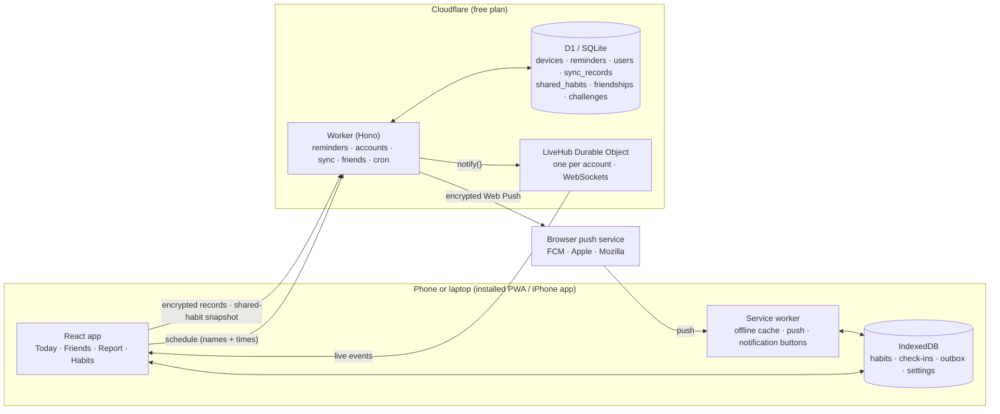

# How Tell Me works

This page explains the architecture, the main flows, and the decisions behind them.

## The big picture



**The key idea:** your data stays yours. Without an account, habits, Yes/No answers, reasons and stats never leave the device, and the server is only an alarm clock that knows when to wake each device and what to call the habit. With an (optional) account, everything is **end-to-end encrypted** before it's uploaded, so devices can sync through a server that can't read them. The only plaintext the server ever holds about your habits is what you explicitly **share with friends**.

## Data

**On the device (IndexedDB, database `tell-me`)**

| Store | Key | Contents |
| --- | --- | --- |
| `habits` | `id` | name, emoji, color, weekdays, planned time, "ask after" minutes, reminders on/off, created/archived dates |
| `checkins` | `habitId:date` | `yes` / `no`, optional reason and note, when, and whether it came from the app or a notification |
| `kv` | `settings`, `account`, `sync`, `share` | settings (week start, weekly report, theme, push device id and token); the account key and profile; the last sync sequence number; the fingerprint of the last shared snapshot |
| `outbox` | `kind:id` | changes waiting to be uploaded (only written while signed in): kind, id, timestamp, deleted? |

One answer per habit per day (`habitId:date`) makes check-ins idempotent: answering again just overwrites. Every habit and check-in also carries `updatedAt`, which decides conflicts between devices.

**On the server (D1, see `api/migrations/0001_init.sql`)**

| Table | Contents |
| --- | --- |
| `devices` | random device id, SHA-256 of the device token, push subscription (endpoint and keys), IANA time zone |
| `reminders` | per device: habit id, title, emoji, weekday bitmask, planned time, offset, `skip_dates`, **`next_fire_at`** (UTC, indexed), `next_date` |
| `users` | random id, SHA-256 of the auth secret, display name, avatar emoji, friend code, time zone, per-account sync sequence (`api/migrations/0002_social.sql`) |
| `sync_records` | per account: kind, **opaque id** (HMAC), sequence number, client timestamp, deleted?, **AES-GCM ciphertext** |
| `shared_habits` | the published snapshot of each habit a user shares: name, emoji, days, check-in time, this week's pattern (`YNMPF.`), streak |
| `friendships`, `reactions`, `nudges` | mutual friendships (both directions), emoji reactions and once-a-day nudges (deleted after two weeks) |
| `challenges`, `challenge_members` | weekly goals ("3×"), members and invites, and which shared habit counts for each member |

## Main flows

### 1. Adding a habit
`parseHabit()` (`web/src/lib/parser.ts`) turns "French class Tue/Thu 19h30" into `{ name, emoji, days: [2,4], time: "19:30" }` with regular expressions, entirely on the device. It understands day names and ranges (`mon-fri`), `daily` / `weekdays` / `weekends`, frequencies (`3x a week`, which spreads to Mon/Wed/Fri), and times like `6pm`, `18:00`, `19h30` and `at 7`. The emoji comes from keyword rules.

### 2. Turning reminders on
1. The browser asks for notification permission.
2. `pushManager.subscribe()` is called with the server's public VAPID key. This creates an endpoint at Google, Apple or Mozilla plus the keys needed to encrypt messages for this browser.
3. The app generates a random device id and a 256-bit token, then sends `PUT /api/devices/:id` with the subscription, the time zone, and the **complete** list of reminders.

### 3. Keeping the server in sync (declarative sync)
Whenever habits, answers or settings change, the app rebuilds the full reminder list (`buildReminders()`), hashes it, and sends it again if the hash changed or if 12 hours have passed. The server replaces the device's reminders in one D1 batch (a transaction). Because the server never gets incremental updates, it can't drift out of sync.

Answers themselves are never sent. The only trace is `skipDates`: if you log the gym at 17:00, that date is sent so the 19:00 "Did you show up?" isn't pushed.

### 4. The scheduler (every minute)
`computeNextFire()` (`api/src/schedule.ts`) finds the next occurrence after a given moment in the **user's time zone**: weekday bitmask, planned time plus offset, skipping answered dates. It converts local wall time to UTC with `Intl.DateTimeFormat` (`api/src/tz.ts`), so DST changes and zones like India's +5:30 work. The result is stored as `next_fire_at`.

The cron handler (`api/src/tick.ts`) then runs:

```sql
SELECT … FROM reminders JOIN devices … WHERE next_fire_at <= :now ORDER BY next_fire_at LIMIT 8
```

Thanks to the index, a tick reads only the rows that are due. That matters because D1's free tier counts rows *scanned*. For each due reminder the handler:

- sends the push and computes the next fire time
- **404/410** (subscription gone): deletes the device
- **429/5xx** (temporary): leaves it due and retries on the next ticks for up to 15 minutes
- **more than 3 hours late** (e.g. after an outage): skips it instead of nagging at the wrong time

### 5. Sending a push
Web Push needs two things, both done with the Web Crypto API in `api/src/webpush.ts`:

- **Encryption (RFC 8291, `aes128gcm`).** An ephemeral ECDH P-256 key pair is made for each message and combined with the browser's public key and auth secret through HKDF to derive an AES-128-GCM key. Only that browser can read the payload, and the push service only relays ciphertext.
- **VAPID (RFC 8292).** An ES256-signed JWT (audience = the push service's origin, expiry under 24 h) proves the message comes from this server. Signed tokens are cached per push service, because signing is the expensive part.

The payload is tiny: `{ type: "checkin", habitId, date, title, emoji, time }`.

### 6. The notification
The service worker (`web/src/sw.ts`) receives the push, reads IndexedDB to personalise it (current streak, already answered?), and shows **"📚 Read: did you show up?"** with **✅ Yes / ❌ No** action buttons.

- Tapping a button writes the check-in straight into IndexedDB (`recordAnswerFromNotification`) and tells any open tab to refresh. The app never opens.
- Tapping the notification body opens `#/checkin/<habit>/<date>`, a big Yes/No screen. This is the path on iPhone and Safari, which don't show action buttons.
- The weekly-report push carries no numbers. The service worker computes the summary on the device ("📊 Your week: 9 of 12 (75%)").

### 7. The iPhone app (reminders without a server)
The native app (`web/ios`, Capacitor 8) runs the same React code in a native shell, but its reminders take a different path:

- `planLocalNotifications()` (`web/src/lib/localReminders.ts`) plans the next 10 days of "Did you show up?" notifications, skips days already answered, and stays under iOS's limit of 64 pending notifications per app. Ids are stable hashes of `habit|date`, so re-planning replaces notifications instead of duplicating them.
- `syncLocalReminders()` (`web/src/lib/native.ts`) hands the plan to iOS with a `CHECKIN` category that has **✅ Yes** and **❌ No** actions. The schedule is rebuilt whenever habits or answers change and every time the app comes to the foreground.
- Pressing a button opens the app for a moment, records the answer, and shows it. **No** goes straight to the reason sheet.
- iOS can clear a web view's storage on a full phone, so the app mirrors everything into native storage (`@capacitor/preferences`) and restores it automatically if IndexedDB comes back empty.

Because the iPhone app needs no server for reminders, it works offline. Accounts, sync and friends work in it too (they use `fetch` and WebSockets, which the native web view supports); the account key is mirrored into native storage as well.

### 8. Accounts without emails or passwords
An account is a random **160-bit key** generated on the device and shown as 8 groups of 4 characters (`web/src/lib/account.ts`). Everything is derived from it with HKDF-SHA256:

| Derived | Used for | Leaves the device? |
| --- | --- | --- |
| `auth` (32 bytes) | `Authorization: Bearer …` on account requests | yes, and the server stores only its SHA-256 |
| `enc` (AES-256-GCM key) | encrypting every synced habit and check-in | never |
| `ids` (HMAC-SHA256 key) | turning record ids into opaque ids | never |

Signing up sends a name, an avatar emoji and the auth secret (`POST /api/account`, idempotent). Adding a device means entering the key there: the device derives the same three keys, `GET /api/me` confirms the account exists, and a full sync follows. Lose every device *and* the key, and the data is gone. That's the honest price of a server that can't read it, so the sign-up screen makes saving the key a required step.

### 9. End-to-end encrypted sync
Every local write (`web/src/lib/db.ts`) stamps `updatedAt` and, when signed in, drops an entry in the `outbox` in the same IndexedDB transaction. The page and the service worker both write through these functions, so a Yes tapped on a notification is queued too. The sync engine (`web/src/lib/sync.ts`) then:

1. **Pushes** the outbox in batches of 200. Each record becomes `{ k, id: HMAC(kind:id), u: updatedAt, d: deleted, x: AES-GCM(json) }`. The IV is random, and the record's identity is bound in as associated data, so the server can't swap ciphertexts between records.
2. **Pulls** everything with a sequence number above the last one it saw, decrypts it, and merges it with **last writer wins per record**. A remote change is skipped when this device holds a newer version, saved or still waiting in the outbox (`applyRemote`). Deleting a habit deletes its check-ins on every device.
3. **Publishes** the shared-habit snapshot if it changed (see 10).

On the server (`api/src/routes/sync.ts`), a push is **one D1 batch, which is a transaction**: it reserves a range of sequence numbers on the user row and upserts the records with `ON CONFLICT … WHERE excluded.updated_at > updated_at`. Because reserving and writing can't interleave with another device's push, a reader never skips a lower sequence number. That's the classic bug with "give me everything since N".

The push also carries `answered: [{habitId, date}]`, so the account's other devices drop that day's reminder (`skip_dates`): answer on the laptop and the phone won't ask. Only the fact that a check-in happened is shared there, never the answer.

Sync runs after every change (debounced), when the app comes to the foreground, every 5 minutes while open, and when the live connection says another device changed something. Calls during a running sync are folded into one follow-up run.

### 10. Sharing with friends
Friends need something the server *can* read, so sharing is opt-in per habit (`habit.shared`). After each sync the app builds a snapshot (`web/src/lib/share.ts`) of the shared habits only: name, emoji, days, check-in time, **this week's pattern** as 7 characters (`Y` yes, `N` no, `M` missed, `P` due today, `F` later, `.` rest) and the streak. Reasons, notes and private habits are never included. `PUT /api/share` replaces the user's snapshot declaratively; unchanged snapshots are skipped by fingerprint on both sides.

A snapshot is only as fresh as the last time its owner opened the app, so the server **moves stale snapshots forward** on read (`normalizeSharedHabit` in `api/src/social.ts`): due days that passed without an answer become missed (which also ends the streak), a new week starts empty, and "today" is computed in the owner's own time zone. The leaderboard, challenge progress and nudge rules all use this normalized view.

### 11. Live updates (Durable Objects + WebSockets)
Each account has one **LiveHub** Durable Object (`api/src/hub.ts`) holding the WebSockets of all its open apps. Browsers can't set headers on a WebSocket, so the app authenticates with a subprotocol: `new WebSocket(url, ['tell-me.v1', 'auth.<secret>'])`. The hub uses the **WebSocket Hibernation API**: idle connections cost nothing, and `ping` is answered by the runtime without waking the object.

When something happens, the worker calls `hub.notify(event)` on the right accounts:

| Event | Sent to | The app… |
| --- | --- | --- |
| `sync` | your other devices | pulls the new records |
| `friends` | you and your friends | refreshes the Friends screen |
| `checkin` | your friends | shows "🦊 Mithun just checked in: 🏋️ Gym ✅" |
| `nudge`, `reaction` | the friend | shows a toast (and a Web Push to their devices) |
| `challenges` | the members | refreshes challenge progress |

The client reconnects with exponential backoff and, on every (re)connect, runs a sync and refreshes the feed, so nothing is lost while offline.

### 12. Nudges, reactions and challenges
- **Nudge:** only for a shared habit that's due today and unanswered, once per friend, habit and day (a primary key, so the limit holds even with concurrent taps). The friend gets a live toast and a Web Push on every device linked to their account.
- **Reaction:** one of 🔥 👏 💪 🎉 ❤️ on a check-in from the last 7 days. Changing the emoji doesn't push again.
- **Challenge:** "Gym 3× this week". Each member picks one of their own shared habits; progress is that habit's Yes count in the member's own current week, so it resets every Monday without a background job.
- A device with web push on is linked to its account (`POST /api/me/devices/:id`, which requires the device's own token), so social pushes reach it.

## Insights engine

`web/src/lib/insights.ts` turns check-ins into at most six plain-language cards, ordered by priority. Every rule has a minimum-data guard:

| Rule | Needs | Example |
| --- | --- | --- |
| Perfect week | ≥ 3 due | "Perfect week: 9 out of 9" |
| Week over week | ≥ 3 due in both weeks, ≥ 10 pt change | "Up 12 points on this time last week" |
| Best week / almost there | ≥ 2 past weeks | "1 more Yes beats your best week" |
| Weak / strong weekday | ≥ 4 due per weekday, 15 pt below average | "Fridays are your weak spot: 42% vs 75%" |
| Top reason | ≥ 3 misses, one reason ≥ 40% | "'Too tired' is behind 11 of your 18 misses" (+ advice) |
| Streak / record | current streak ≥ 3 | "New record: 10 in a row for French practice" |
| Morning vs evening | ≥ 6 due in each | "You show up more in the morning (92% vs 66%)" |
| Slipping habit | ≥ 4 due in 4 weeks, < 50% | "Read 20 pages is slipping (41%)" |
| Unanswered | ≥ 2 this week | "2 check-ins still unanswered" |

**Fair comparisons.** On a Wednesday evening, "this week" is compared with *last week up to Wednesday evening*, not with the whole of last week (`compareWithLastWeek`).

**Definition used everywhere:** a check-in is *due* once its ask time has passed. Rate = Yes ÷ due. Unanswered counts as a miss, which is honest and nudges people to answer.

## Decisions and trade-offs

| Decision | Why | Alternative considered |
| --- | --- | --- |
| Local-first, accounts optional | Works fully without signing up; an account adds sync and friends | Accounts required: simpler model, but a sign-up wall before the first habit |
| Account = a key, no email/password | Fastest possible sign-up for friends, no email service, no password database, works in the iPhone app; enables end-to-end encryption | Email magic links (needs a domain and an email provider), Sign in with Google/Apple (setup and fees), passkeys (bound to one domain) |
| End-to-end encrypted records | The server can't read private habits, so a breach leaks ciphertext | Plain cloud sync: easier queries and recovery, much weaker privacy |
| Last writer wins per record | Habits and check-ins are small, independent records; edits rarely collide. Each edit is stamped later than the version it was made on, so a device with a slow clock can't lose its edits | CRDTs: merge field by field, far more complexity for no visible benefit here |
| Shared habits as a plaintext snapshot | Friends need a readable view; publishing only opted-in habits keeps the rest encrypted | Encrypt per friend: no server-side leaderboards or nudge rules |
| WebSockets through Durable Objects | Instant updates; hibernation makes idle connections free on the Workers plan | Polling every few seconds: simpler, slower, and many more requests |
| Push via a tiny worker | Real notifications with Yes/No buttons, the core of the idea | Calendar alarms only (kept as a fallback .ics) |
| Cron + indexed `next_fire_at` | One cheap query per minute, simple to reason about | One timer per user (Durable Object alarms): precise, but more moving parts |
| Own Web Push code | Two libraries were tried. One used the legacy `aesgcm` format, which Safari/iOS doesn't accept; the other padded every message to 4 KB and cost ~1.4 ms of CPU per push. The final version is ~0.8 ms. | Use a library as-is |
| Batch 8 pushes per minute | Fits the ~10 ms CPU budget of Workers Free | Workers Paid ($5/mo) with a higher `MAX_PUSHES_PER_TICK` |
| Rule-based insights | Explainable, deterministic, testable, free, works offline | An LLM summary (on the roadmap as an opt-in) |
| Hash routing | Works on GitHub Pages and inside notifications without server rewrites | History API with a 404.html redirect |
| Hand-built SVG charts | Small bundle, full control of accessibility (table view, focus tooltips) | Recharts / Chart.js |

## Security and privacy

- Without an account, the server never stores answers. A database leak exposes reminder names and times, nothing more.
- With an account, private data is AES-256-GCM ciphertext under keys derived on the device; record ids are HMACs, so not even dates are visible. The server stores the SHA-256 of the auth secret, never the account key.
- What friends see is limited to habits the user marked as shared. Deleting the account removes every row about it in one transaction, and friends' screens update live.
- Friend codes avoid look-alike characters, can be rotated (old invite links stop working), and friend lists, challenges and members are capped. Nudges are limited to one per friend, habit and day, and a reaction only pushes the first time.
- The timestamp and the deleted flag of each synced record are sealed inside the ciphertext, so a malicious server can't delete records or roll them back by replaying old ones.
- Abuse limits that protect the free plan for everyone: sign-ups per network per hour, a daily write budget per account (sync and sharing), a storage cap per account, 4 KB per record, and shared snapshots must describe the owner's actual today. Live events only wake the hubs of accounts with an app open recently.
- Only the organiser of a challenge can invite, and only their own friends: members agreed to share their habit with the people the organiser picks.
- Device tokens are random 256-bit values, stored as SHA-256 hashes and compared in constant time.
- Push endpoints must belong to a known push service (FCM, Apple, Mozilla, Windows). Otherwise anyone could use the worker to POST to arbitrary URLs (SSRF).
- Request bodies are validated with Zod: sizes, formats, real IANA time zones, no duplicate ids.
- CORS can be restricted to the site's origin (`ALLOWED_ORIGINS`).
- The VAPID private key is a Cloudflare secret, never in the repo.

## Limits and how it would scale

- **Free plan:** 8 pushes per minute (~11,500/day). A reminder may arrive a minute or two late at busy times.
- **To 10k+ users:** move to Workers Paid and raise the batch size, then fan out sends through Cloudflare Queues (one consumer invocation per batch). The indexed query already scales, because it only reads rows that are due.
- **Sync and live updates:** each account's records are read by an indexed `(user_id, seq)` query, and each account's sockets live in their own Durable Object, so both scale per user rather than globally.

## Testing strategy

| Layer | What | Where |
| --- | --- | --- |
| Unit (116) | parser, schedule, stats, insights, ICS, reminders, notifications, IndexedDB (fake-indexeddb), time zones and DST, scheduler, validation, Web Push encryption checked against Mozilla's reference decryptor, VAPID signature; key derivation checked against Node's own HKDF, encryption and opaque ids, the sync engine with two simulated devices (conflicts, deletes, pending edits), shared-snapshot normalization | `web/test`, `api/test` |
| Integration (23) | real worker in `wrangler dev` with local D1 + Durable Objects + cron trigger + a mock push service that decrypts every message: reminders, accounts, encrypted sync with last-writer-wins, live WebSocket events, friends, nudges and reactions delivered as pushes, challenges, account deletion | `api/scripts/integration-test.mjs` |
| End-to-end (41) | **Two people and a laptop** in real browsers against the real worker: sign-up, invite link, live check-ins, reactions, nudges, a weekly challenge, signing in on a second device with the key, a change on one device appearing live on the other, sign-out. Plus the single-user flows: onboarding → quick add → Yes/undo → No + reason → edit → import → demo → report → calendar → deep link → accessibility names → no horizontal overflow at 360 px; the **full push flow** (real app + real service worker + real worker, push delivered to the service worker via the Chrome DevTools Protocol); and the **iPhone app paths** behind a fake native shell (scheduling, Yes/No buttons, restore from native backup) | `e2e/` |

## FAQ

**How does a notification reach an iPhone?** The app subscribes through the browser, which gives an Apple push endpoint plus encryption keys. My worker encrypts the message with those keys, signs a VAPID token, and POSTs it to Apple, which delivers it to the phone. On iPhone this only works for Home Screen web apps (iOS 16.4+), and iOS doesn't show action buttons, so a tap opens a Yes/No screen.

**Why doesn't the server store the answers?** It doesn't need them for reminders, which depend only on the schedule. With an account, answers are synced, but end-to-end encrypted: the server stores ciphertext it can't read.

**How does sync work if the server can't read anything?** Each device holds the account key and derives an AES key from it. Records are encrypted before upload and given HMAC ids, so the same record maps to the same row from every device. The server only orders changes with a per-account sequence number; the devices decrypt and merge them, newest edit wins.

**How do you avoid missing changes when two devices sync at the same time?** Reserving sequence numbers and writing the records happen in one D1 transaction, so a reader that asks for "everything after N" can never skip a lower number that's still being written.

**How do friends see your progress if it's encrypted?** Sharing is per habit. Shared habits are published as a small readable snapshot (name, today's answer, this week's Yes/No, streak). Everything else stays encrypted.

**How are the live updates built?** One Durable Object per account holds that account's WebSockets, with the hibernation API so idle connections are free. The API calls the object's `notify()` method over RPC whenever a friend checks in, nudges, reacts or another device syncs.

**How do you handle time zones and daylight saving?** Each reminder is stored in local time plus the IANA zone. The next fire time is computed with `Intl` and stored in UTC. After DST, "19:00 Paris" is still 19:00. The tests cover the March and October changes and India's +5:30.

**What if the cron is late or the push service is down?** Temporary errors are retried for 15 minutes. Expired subscriptions are deleted. Anything more than 3 hours late is skipped rather than sent at a silly time.

**Why write your own Web Push code instead of a library?** I tried two Workers-compatible libraries. One used the old `aesgcm` encoding that Safari rejects, and the other padded every push to 4 KB and used ~70% more CPU in my benchmark, which matters with a 10 ms budget. The RFCs are short, and my tests check the encryption against Mozilla's reference implementation.

**How did you make the insights trustworthy?** Every rule has a minimum sample size, comparisons are like-for-like (this week so far vs the same point last week), and the definitions are consistent (Yes ÷ due).

**Why is the iPhone app built with Capacitor instead of Swift?** One codebase for web, Android and iPhone, and all the tested logic (schedule, stats, insights) is reused. The parts that have to be native (notifications with action buttons, native storage, the share sheet) go through Capacitor plugins. A widget would be the first thing I'd write in Swift.

**What would you build next?** Push notifications for friends' nudges inside the iPhone app (APNs), a passkey as an optional way to recover the account, flexible "3× a week" goals without fixed days, and a French UI.
