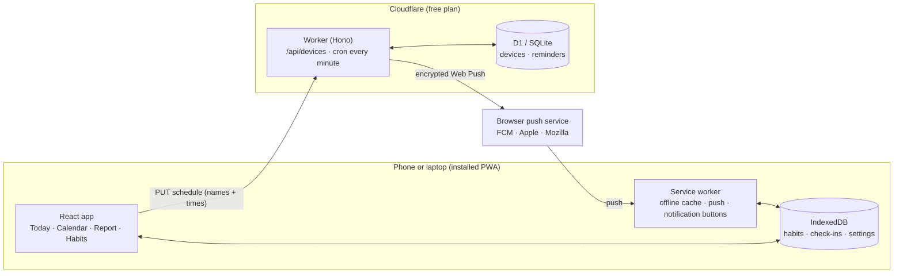

# How Tell Me works

This page explains the architecture, the main flows, and the decisions behind them. It is written to be read before an interview.

## The big picture



**The key idea:** all of your data (habits, Yes/No answers, reasons, stats) stays on your device. The server is only an alarm clock. It knows when to wake each device up and what to call the habit, and nothing else. That keeps the server tiny and free to run, and it is a privacy feature you can explain in one sentence.

## Data

**On the device (IndexedDB, database `tell-me`)**

| Store | Key | Contents |
| --- | --- | --- |
| `habits` | `id` | name, emoji, color, weekdays, planned time, "ask after" minutes, reminders on/off, created/archived dates |
| `checkins` | `habitId:date` | `yes` / `no`, optional reason and note, when, and whether it came from the app or a notification |
| `kv` | `settings` | week start, weekly-report day and time, theme, push device id and token |

One answer per habit per day (`habitId:date`) makes check-ins idempotent: answering again just overwrites.

**On the server (D1, see `api/migrations/0001_init.sql`)**

| Table | Contents |
| --- | --- |
| `devices` | random device id, SHA-256 of the device token, push subscription (endpoint and keys), IANA time zone |
| `reminders` | per device: habit id, title, emoji, weekday bitmask, planned time, offset, `skip_dates`, **`next_fire_at`** (UTC, indexed), `next_date` |

## Main flows

### 1. Adding a habit
`parseHabit()` (`web/src/lib/parser.ts`) turns "French class Tue/Thu 19h30" into `{ name, emoji, days: [2,4], time: "19:30" }` with regular expressions, entirely on the device. It understands day names and ranges (`mon-fri`), `daily` / `weekdays` / `weekends`, frequencies (`3x a week`, which spreads to Mon/Wed/Fri), and times like `6pm`, `18:00`, `19h30` and `at 7`. The emoji comes from keyword rules.

### 2. Turning reminders on
1. The browser asks for notification permission.
2. `pushManager.subscribe()` is called with the server's public VAPID key. This creates an endpoint at Google, Apple or Mozilla plus the keys needed to encrypt messages for this browser.
3. The app generates a random device id and a 256-bit token, then sends `PUT /api/devices/:id` with the subscription, the time zone, and the **complete** list of reminders.

### 3. Keeping the server in sync (declarative sync)
Whenever habits, answers or settings change, the app rebuilds the full reminder list (`buildReminders()`), hashes it, and sends it again if the hash changed or if 12 hours have passed. The server replaces the device's reminders in one D1 batch (a transaction). Because the server never gets incremental updates, it can't drift out of sync.

Answers themselves are never sent. The only trace is `skipDates`: if you log the gym at 17:00, that date is sent so the 19:00 "Did you show up?" isn't pushed.

### 4. The scheduler (every minute)
`computeNextFire()` (`api/src/schedule.ts`) finds the next occurrence after a given moment in the **user's time zone**: weekday bitmask, planned time plus offset, skipping answered dates. It converts local wall time to UTC with `Intl.DateTimeFormat` (`api/src/tz.ts`), so DST changes and zones like India's +5:30 work. The result is stored as `next_fire_at`.

The cron handler (`api/src/tick.ts`) then runs:

```sql
SELECT … FROM reminders JOIN devices … WHERE next_fire_at <= :now ORDER BY next_fire_at LIMIT 8
```

Thanks to the index, a tick reads only the rows that are due. That matters because D1's free tier counts rows *scanned*. For each due reminder the handler:

- sends the push and computes the next fire time
- **404/410** (subscription gone): deletes the device
- **429/5xx** (temporary): leaves it due and retries on the next ticks for up to 15 minutes
- **more than 3 hours late** (e.g. after an outage): skips it instead of nagging at the wrong time

### 5. Sending a push
Web Push needs two things, both done with the Web Crypto API in `api/src/webpush.ts`:

- **Encryption (RFC 8291, `aes128gcm`).** An ephemeral ECDH P-256 key pair is made for each message and combined with the browser's public key and auth secret through HKDF to derive an AES-128-GCM key. Only that browser can read the payload, and the push service only relays ciphertext.
- **VAPID (RFC 8292).** An ES256-signed JWT (audience = the push service's origin, expiry under 24 h) proves the message comes from this server. Signed tokens are cached per push service, because signing is the expensive part.

The payload is tiny: `{ type: "checkin", habitId, date, title, emoji, time }`.

### 6. The notification
The service worker (`web/src/sw.ts`) receives the push, reads IndexedDB to personalise it (current streak, already answered?), and shows **"📚 Read: did you show up?"** with **✅ Yes / ❌ No** action buttons.

- Tapping a button writes the check-in straight into IndexedDB (`recordAnswerFromNotification`) and tells any open tab to refresh. The app never opens.
- Tapping the notification body opens `#/checkin/<habit>/<date>`, a big Yes/No screen. This is the path on iPhone and Safari, which don't show action buttons.
- The weekly-report push carries no numbers. The service worker computes the summary on the device ("📊 Your week: 9 of 12 (75%)").

### 7. The iPhone app (no server at all)
The native app (`web/ios`, Capacitor 8) runs the same React code in a native shell, but its reminders take a different path:

- `planLocalNotifications()` (`web/src/lib/localReminders.ts`) plans the next 10 days of "Did you show up?" notifications, skips days already answered, and stays under iOS's limit of 64 pending notifications per app. Ids are stable hashes of `habit|date`, so re-planning replaces notifications instead of duplicating them.
- `syncLocalReminders()` (`web/src/lib/native.ts`) hands the plan to iOS with a `CHECKIN` category that has **✅ Yes** and **❌ No** actions. The schedule is rebuilt whenever habits or answers change and every time the app comes to the foreground.
- Pressing a button opens the app for a moment, records the answer, and shows it. **No** goes straight to the reason sheet.
- iOS can clear a web view's storage on a full phone, so the app mirrors everything into native storage (`@capacitor/preferences`) and restores it automatically if IndexedDB comes back empty.

Because the iPhone app needs no server, it works offline and collects no data at all, which also keeps the App Store privacy answers simple.

## Insights engine

`web/src/lib/insights.ts` turns check-ins into at most six plain-language cards, ordered by priority. Every rule has a minimum-data guard:

| Rule | Needs | Example |
| --- | --- | --- |
| Perfect week | ≥ 3 due | "Perfect week: 9 out of 9" |
| Week over week | ≥ 3 due in both weeks, ≥ 10 pt change | "Up 12 points on this time last week" |
| Best week / almost there | ≥ 2 past weeks | "1 more Yes beats your best week" |
| Weak / strong weekday | ≥ 4 due per weekday, 15 pt below average | "Fridays are your weak spot: 42% vs 75%" |
| Top reason | ≥ 3 misses, one reason ≥ 40% | "'Too tired' is behind 11 of your 18 misses" (+ advice) |
| Streak / record | current streak ≥ 3 | "New record: 10 in a row for French practice" |
| Morning vs evening | ≥ 6 due in each | "You show up more in the morning (92% vs 66%)" |
| Slipping habit | ≥ 4 due in 4 weeks, < 50% | "Read 20 pages is slipping (41%)" |
| Unanswered | ≥ 2 this week | "2 check-ins still unanswered" |

**Fair comparisons.** On a Wednesday evening, "this week" is compared with *last week up to Wednesday evening*, not with the whole of last week (`compareWithLastWeek`).

**Definition used everywhere:** a check-in is *due* once its ask time has passed. Rate = Yes ÷ due. Unanswered counts as a miss, which is honest and nudges people to answer.

## Decisions and trade-offs

| Decision | Why | Alternative considered |
| --- | --- | --- |
| Local-first, no accounts | Zero sign-up friction, private by design, nothing sensitive to protect on the server | Accounts + cloud DB: multi-device sync, but much more surface area (auth, GDPR) |
| Push via a tiny worker | Real notifications with Yes/No buttons, the core of the idea | Calendar alarms only (kept as a fallback .ics) |
| Cron + indexed `next_fire_at` | One cheap query per minute, simple to reason about | One timer per user (Durable Object alarms): precise, but more moving parts |
| Own Web Push code | Two libraries were tried. One used the legacy `aesgcm` format, which Safari/iOS doesn't accept; the other padded every message to 4 KB and cost ~1.4 ms of CPU per push. The final version is ~0.8 ms. | Use a library as-is |
| Batch 8 pushes per minute | Fits the ~10 ms CPU budget of Workers Free | Workers Paid ($5/mo) with a higher `MAX_PUSHES_PER_TICK` |
| Rule-based insights | Explainable, deterministic, testable, free, works offline | An LLM summary (on the roadmap as an opt-in) |
| Hash routing | Works on GitHub Pages and inside notifications without server rewrites | History API with a 404.html redirect |
| Hand-built SVG charts | Small bundle, full control of accessibility (table view, focus tooltips) | Recharts / Chart.js |

## Security and privacy

- The server never stores answers. A database leak exposes habit names and times, nothing more.
- Device tokens are random 256-bit values, stored as SHA-256 hashes and compared in constant time.
- Push endpoints must belong to a known push service (FCM, Apple, Mozilla, Windows). Otherwise anyone could use the worker to POST to arbitrary URLs (SSRF).
- Request bodies are validated with Zod: sizes, formats, real IANA time zones, no duplicate ids.
- CORS can be restricted to the site's origin (`ALLOWED_ORIGINS`).
- The VAPID private key is a Cloudflare secret, never in the repo.

## Limits and how it would scale

- **Free plan:** 8 pushes per minute (~11,500/day). A reminder may arrive a minute or two late at busy times.
- **To 10k+ users:** move to Workers Paid and raise the batch size, then fan out sends through Cloudflare Queues (one consumer invocation per batch). The indexed query already scales, because it only reads rows that are due.
- **Multi-device:** today each device has its own data. Sync would need an account and an encrypted blob per user, which is why it's on the roadmap and not in v1.

## Testing strategy

| Layer | What | Where |
| --- | --- | --- |
| Unit (88) | parser, schedule, stats, insights, ICS, reminders, notifications, IndexedDB (fake-indexeddb), time zones and DST, scheduler, validation, Web Push encryption checked against Mozilla's reference decryptor, VAPID signature | `web/test`, `api/test` |
| Integration (12) | real worker in `wrangler dev` with local D1 + cron trigger + a mock push service that decrypts every message | `api/scripts/integration-test.mjs` |
| End-to-end (30) | Playwright: onboarding → quick add → Yes/undo → No + reason → edit → import → demo → report → calendar → deep link → accessibility names → no horizontal overflow at 360 px; the **full push flow** (real app + real service worker + real worker, push delivered to the service worker via the Chrome DevTools Protocol); and the **iPhone app paths** behind a fake native shell (scheduling, Yes/No buttons, restore from native backup) | `e2e/` |

## FAQ

**How does a notification reach an iPhone?** The app subscribes through the browser, which gives an Apple push endpoint plus encryption keys. My worker encrypts the message with those keys, signs a VAPID token, and POSTs it to Apple, which delivers it to the phone. On iPhone this only works for Home Screen web apps (iOS 16.4+), and iOS doesn't show action buttons, so a tap opens a Yes/No screen.

**Why doesn't the server store the answers?** It doesn't need them. Reminders depend only on the schedule. Keeping answers on the device makes the app private by default, free to host, and simpler (no accounts, no personal data to secure). The trade-off is no sync across devices yet.

**How do you handle time zones and daylight saving?** Each reminder is stored in local time plus the IANA zone. The next fire time is computed with `Intl` and stored in UTC. After DST, "19:00 Paris" is still 19:00. The tests cover the March and October changes and India's +5:30.

**What if the cron is late or the push service is down?** Temporary errors are retried for 15 minutes. Expired subscriptions are deleted. Anything more than 3 hours late is skipped rather than sent at a silly time.

**Why write your own Web Push code instead of a library?** I tried two Workers-compatible libraries. One used the old `aesgcm` encoding that Safari rejects, and the other padded every push to 4 KB and used ~70% more CPU in my benchmark, which matters with a 10 ms budget. The RFCs are short, and my tests check the encryption against Mozilla's reference implementation.

**How did you make the insights trustworthy?** Every rule has a minimum sample size, comparisons are like-for-like (this week so far vs the same point last week), and the definitions are consistent (Yes ÷ due).

**Why is the iPhone app built with Capacitor instead of Swift?** One codebase for web, Android and iPhone, and all the tested logic (schedule, stats, insights) is reused. The parts that have to be native (notifications with action buttons, native storage, the share sheet) go through Capacitor plugins. A widget would be the first thing I'd write in Swift.

**What would you build next?** Encrypted sync with an optional account, flexible "3x a week" goals, a French UI, and an opt-in AI summary on top of the rule-based insights.
